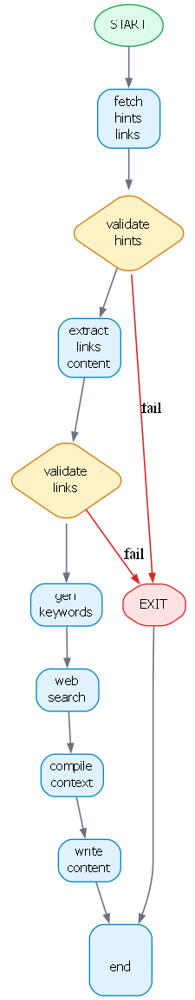

# Auto Blogger
<details open>
<summary><strong>Overview</strong></summary>

This repository contains the source code for an **MCP-based server–client system for automated blogging**.

The system is composed of **three independent MCP servers**—Content Creation, Hashnode, and Markdown File Management—connected to a central client via **Server-Sent Events (SSE)**. Together, they enable end-to-end blog automation: from idea and research, to content generation, local editing, and publishing.

At its core, the system uses:
- **LangGraph** to orchestrate a deterministic, multi-step content creation pipeline
- **Groq / Ollama (open-source LLMs)** for generation
- **LangSmith** for tracing, debugging, and observability
- **Tavily Search** for grounded web enrichment

Users can:
- Enter a prompt to generate blog content on a topic
- Provide additional structured inputs via `input_file.json`
- Generate keywords, enrich content via web search, and include images
- Save content locally as markdown, edit it, and publish to Hashnode
- Manage drafts and published posts programmatically

The architecture prioritizes **grounded generation, validation gates, and production safety**, making it suitable for real publishing workflows rather than simple prompt-to-text demos.
</details>

---
<details open>
<summary><strong>Technology & Execution Flow</strong></summary>

This system is built as a **tool-driven, graph-orchestrated MCP application**, where responsibility is cleanly separated across servers and execution is explicitly controlled.

---

## Content Creation Graph

<p align="center">
  
</p>

The diagram above represents the **LangGraph-based execution flow** used by the Content Creation server.
Each node performs a single, well-defined responsibility, with explicit validation gates and failure paths.

---

## High-Level Architecture

### Core Components

- **MCP Client**
  - Entry point for user interaction
  - Sends prompts and tool calls
  - Maintains SSE connections to all servers

- **MCP Servers**
  - Content Creation Server
  - Hashnode Server
  - Markdown File Server

- **Execution Engine**
  - **LangGraph** for content generation flow
  - Deterministic state transitions
  - Validation-first design

- **AI & Observability**
  - **Groq / Ollama**: Open-source LLM inference
  - **LangSmith**: Execution tracing and debugging
  - **Tavily**: Web search and enrichment

---

## LangGraph: How Content Is Generated

The Content Creation Server uses **LangGraph** to model blog generation as a **stateful graph**, not a single prompt.

### Why LangGraph?
- Explicit control flow
- Validation checkpoints
- Clear failure paths
- Easy extensibility (add/remove nodes)

---

## Content Generation Flow (Conceptual)

1. **User Prompt**
   - User provides a topic via client
   - Optional structured inputs via `input_file.json`

2. **Fetch Inputs**
   - Reads:
     - Content hints
     - Reference URLs
     - Image URLs (open-source)
   - Inputs are normalized into graph state

3. **Hint Validation**
   - Ensures hints are coherent and relevant
   - Prevents weak or misleading guidance

4. **Link Content Extraction**
   - Fetches and parses provided URLs
   - Extracts meaningful textual context

5. **Link Validation**
   - Ensures extracted content aligns with topic
   - Invalid references trigger early exit

6. **Keyword Generation**
   - Generates topic-aligned keywords
   - Used for SEO and search enrichment

7. **Tavily Web Search**
   - Searches using generated keywords
   - Retrieves fresh, relevant context
   - Also retrieves related images where applicable

8. **Context Compilation**
   - Merges:
     - Validated hints
     - Extracted link content
     - Tavily search results
     - Keywords
     - Image references

9. **Content Writing**
   - LLM generates structured markdown
   - References, images, and hints are incorporated
   - Output is publication-ready

10. **Output Handling**
    - Markdown can be:
      - Saved locally
      - Edited by user
      - Published to Hashnode

---

## Role of `input_file.json`

`input_file.json` allows users to **augment the agent’s reasoning** with structured inputs:

- **hints**  
  Explicit talking points the agent must consider

- **links**  
  URLs from which content is extracted and referenced

- **images**  
  Open-source image URLs to be included in the article

This enables **human-in-the-loop guidance** without rewriting prompts.

---

## MCP Servers & Tools

### Content Creation Server
Handles topic-to-markdown generation using LangGraph.

| Tool | Description |
|-----|------------|
| `blog_content_creator` | Generates a ready-to-publish blog article using LangGraph, Groq, Tavily, and user inputs |

---

### Hashnode Server
Handles all publishing and content management actions.

| Tool | What it does |
|-----|-------------|
| `get_authenticated_user` | Returns details of the authenticated Hashnode user |
| `create_draft_article` | Creates a draft article in the user’s publication |
| `publish_draft_article` | Publishes an existing draft |
| `update_post_article` | Updates a published post |
| `remove_post_article` | Deletes a published post |
| `get_publication_info` | Fetches publication metadata |
| `get_publication_posts` | Lists recent posts from a publication |

---

### Markdown File Server
Handles local markdown persistence and editing workflows.

| Tool | What it does |
|-----|-------------|
| `save_markdown_file` | Saves content to `markdowns/` |
| `read_markdown_file` | Reads a markdown file |
| `list_markdown_files` | Lists all stored markdown files |
| `delete_markdown_file` | Deletes a markdown file |

---

## End-to-End User Workflows

### Generate → Edit → Publish
1. User enters topic
2. Content is generated
3. Markdown is saved locally
4. User edits file
5. Client reads file and publishes to Hashnode

### Draft-Only Workflow
- Generate content
- Create draft in Hashnode
- Publish later

### Post-Management Workflow
- List posts
- Update content
- Delete posts if needed

---

## Observability & Debugging

- **LangSmith** traces:
  - Each LangGraph node
  - Prompt inputs and outputs
  - Tool calls
- Makes failures easy to diagnose
- Enables prompt and flow optimization

---

## Summary

This is not a simple LLM wrapper.

It is a **production-oriented, MCP-driven blogging system** that:
- Separates concerns across servers
- Uses LangGraph for controlled reasoning
- Grounds content via structured inputs and web search
- Supports real publishing workflows with editing and lifecycle management

---

## Failure Handling Philosophy

- Validation nodes act as **quality gates**
- The system prefers:
  - ❌ Early exit  
  - ✅ High confidence output  
over producing low-quality content

This design makes it suitable for **production-grade automated blogging**.

---

## Why This Architecture Works

- Avoids hallucination-heavy generation
- Keeps content verifiable
- Makes debugging trivial (node-level logs)

---


</details>


---

<details open>
<summary><strong>Installation & Setup</strong></summary>

##### 1. Create a virtual environment (Python 3.11 recommended)
##### 2. Install dependencies
    pip install -r requirements.txt

##### 3. Environment variables
Create a `.env` file in the root directory and add the required environment variables
(API keys, tokens, etc.). Sample .env file is present as `.env.example`
</details>

---

<details open>
<summary><strong>Repository Structure</strong></summary>

```
├── .env
├── .env.example
├── .gitignore
├── content_graph.png
├── input_file.json
├── logging_config.py
├── README.md
├── requirements.txt
│
├── configs
│   ├── configs.py
│   └── configs.yaml
│
├── logs
│
├── markdowns
│
├── mcp_files
│   ├── mcp_config.json
│   │
│   ├── client
│   │   └── client.py
│   │
│   └── servers
│       ├── content_creation_server.py
│       ├── hashnode_server.py
│       └── markdown_file_server.py
│
└── server_src
    ├── hashnode_graphql_queries.py
    │
    └── content_creation
        ├── test.py
        ├── utils.py
        ├── __init__.py
        │
        ├── configs
        │   ├── configs.py
        │   └── configs.yaml
        │
        └── graph
            ├── graph.py
            ├── state.py
            ├── __init__.py
            │
            ├── chains
            │   ├── content_writer_chain.py
            │   ├── keyword_generator_chain.py
            │   ├── relevancy_grader_chain.py
            │   └── __init__.py
            │
            └── nodes
                ├── compile_context.py
                ├── extract_links_content.py
                ├── fetch_hints_links.py
                ├── gen_keywords.py
                ├── other_nodes.py
                ├── validate_title_vs_hints.py
                ├── validate_title_vs_links.py
                ├── web_search.py
                ├── write_content.py
                └── __init__.py
```
</details>

---

<details open>
<summary><strong>File & Directory Description</strong></summary>

<details open>
<summary><strong>Root Files</strong></summary>

- `.env`: Stores environment variables (API keys, secrets, configuration flags).
  
- `.env.example`: Sample .env file for reference.

- `.gitignore`: Specifies files and directories ignored by Git.

- `content_graph.png`: Visual representation of the content creation graph and execution flow.

- `input_file.json`: Input payload defining content requirements (hints), urls (which will be referred by the agent to include its content), images url (opensource images which might be used in the content).
  ```json
  {
  "hints": [
    "explain how yan le cunn said that gen ai is boring him and that's why he quit and gone to work on AGI",
    "add this - 'At their core, LLMs simulate intelligence; they don't possess it. The leap to AGI begins when imitation ends.'"
  ],
  "links": [
    "https://www.linkedin.com/posts/yann-lecun_as-many-of-you-have-heard-through-rumors-activity-7397020300451749888-2lhA/"
  ],
  "images": [
    "https://itchronicles.com/wp-content/uploads/2020/11/where-is-ai-used.jpg"]
  }
  ```

- `logging_config.py`: Centralized logging configuration for the entire application.

- `requirements.txt`: Python dependencies required to run the project.

- `README.md`: Project documentation.

</details>

---

<details open>
<summary><strong>configs/</strong></summary>

Configuration layer for global application settings.

- `configs.py`: Python-based configuration definitions.

- `configs.yaml`: YAML-based configuration file for environment-specific or runtime settings.
</details>


---

<details open>
<summary><strong>logs/</strong></summary>

- Stores application logs generated during execution.
- Created dynamically based on logging configuration.
</details>

---

<details open>
<summary><strong>markdowns/</strong></summary>

- Output directory for generated markdown files.
- Typically used to store blog or article content before publishing.
</details>

---

<details open>
<summary><strong>mcp_files/</strong></summary>

Contains configuration, client logic, and server implementations for MCP-style orchestration.

- `mcp_config.json` 
  Defines MCP server/client configuration and routing.

<details open>
<summary><strong>client/</strong></summary>

- `client.py`
  Client responsible for interacting with MCP servers.
</details>


<details open>
<summary><strong>servers/</strong></summary>

- `content_creation_server.py`
  Server responsible for orchestrating content generation workflows.

- `hashnode_server.py`
  Server handling integration with Hashnode (publishing, API communication).

- `markdown_file_server.py`
  Server responsible for markdown file handling (read/write/storage).
</details>


</details>

---

<details open>
<summary><strong>server_src/</strong></summary>

Core backend logic for content creation and publishing.

- `hashnode_graphql_queries.py`
  Contains GraphQL queries and mutations for Hashnode API integration.

---


<details open>
<summary><strong>server_src/content_creation/</strong></summary>

Main module implementing the content creation pipeline.

- `test.py`
  Test or experimentation script for content creation logic.

- `utils.py`
  Shared utility functions used across content creation modules.

- `__init__.py`
  Marks the directory as a Python package.

---

<details open>
<summary><strong>server_src/content_creation/configs/</strong></summary>

Configuration specific to the content creation pipeline.

- `configs.py`
  Python-based configuration logic.

- `configs.yaml`
  YAML configuration for pipeline behavior and tuning.
</details>

---

<details open>
<summary><strong>server_src/content_creation/graph/</strong></summary>

Implements a Langraph-based execution model for content creation.

- `graph.py`
  Defines the overall graph structure and execution flow.

- `state.py`
  Defines the state object passed between graph nodes.

- `__init__.py`
  Package initializer.

---


<details open>
<summary><strong>server_src/content_creation/graph/chains/</strong></summary>


Reusable logic or LLM chains used by graph nodes.

- `content_writer_chain.py`
  Generates long-form content.

- `keyword_generator_chain.py`
  Generates topic-based keywords.

- `relevancy_grader_chain.py`
  Grades content relevance and alignment with input topic.

- `__init__.py`
  Package initializer.
</details>

---


<details open>
<summary><strong>server_src/content_creation/graph/nodes/</strong></summary>

Atomic processing units forming the content creation graph.

- `compile_context.py`
  Compiles context from multiple sources before content generation.

- `extract_links_content.py`
  Extracts and processes content from referenced links.

- `fetch_hints_links.py`
  Fetches hint or reference links from `input_file.json`.

- `gen_keywords.py`
  Generates keywords based on topic and context.

- `other_nodes.py`
  Miscellaneous or helper graph nodes.

- `validate_title_vs_hints.py`
  Validates hint data relevance against title.

- `validate_title_vs_links.py`
  Validates extracted link content relevance against title.

- `web_search.py`
  Performs web search for additional context.

- `write_content.py`
  Final content generation node.

- `__init__.py`
  Package initializer.
</details>

---
</details>
</details>
</details>
</details>

<details open>
<summary><strong>Execution</strong></summary>

Execution can be run in multiple modes depending on the use case.

##### 1. Content Creation Only
Runs the standalone content creation pipeline without MCP servers.

    python .\server_src\content_creation\test.py

---

##### 2. MCP-Based Execution

In MCP mode, each server must be started **individually in separate terminals**.

##### Start MCP Servers

    python .\mcp_files\servers\content_creation_server.py
    python .\mcp_files\servers\hashnode_server.py
    python .\mcp_files\servers\markdown_file_server.py

##### Run MCP Client

After all servers are running, start the client:

    python .\mcp_files\client\client.py

</details>

---


<details open>
<summary><strong>Notes</strong></summary>

- Ensure all required environment variables are set in `.env`
- Add data to `input_file.json`
- Servers must be running before starting the MCP client
- Logs are written to the `logs/` directory
- Markdowns are added to `markdowns/` directory
---
</details>
